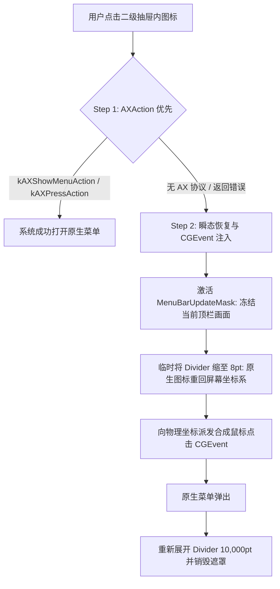

# macOS 菜单栏整合管理工具底层机制与架构调研报告（联网实勘版）

> **技术基准**：基于 `pi-web-access` 对 Apple 官方规范、现有主流商业及开源竞品（iBar、Ice、Thaw、Barbee、Bartender）的底层实现机制实勘，结合本地 macOS 15 (Sequoia) M2 MacBook Air 的实机验证。

---

## 一、系统菜单栏管理工具的技术流派与竞品解构

根据对 GitHub 开源项目（`jordanbaird/Ice`、`thaw-app/Thaw`、`MaZhaolin/iBar`）及 Mac App Store 商业软件（`iBar Pro`、`Barbee`）的源码分析，菜单栏管理工具在业界存在两代技术范式：

### 1. 经典折叠模式（Classic / Fold Mode - 代表：Hidden Bar、Dozer）
- **实现原理**：通过在状态栏注册一个分隔符（`NSStatusItem`），折叠时将其长度暴增至极大值（如 `NSStatusItem.length = 10,000 pt`），将位于其左侧的图标强行挤出屏幕可视区（或移入应用菜单背后）。
- **权限要求**：**零权限**。纯 AppKit 标准 API，可在 Mac App Store (MAS) 完全沙盒化上架。
- **刘海屏死穴**：在带刘海的 MacBook（M1/M2/M3/M4）上，被挤压的图标会**卡在物理刘海硬件背后**而彻底无法点击，甚至导致用户找不到图标。

### 2. 聚合二级抽屉模式（Aggregation / Secondary Bar - 代表：iBar、Barbee、Thaw）
- **实现原理**：
  1. 原生栏维持推挤折叠，避免顶栏拥挤。
  2. 申请 **Accessibility（辅助功能）** + **Screen Recording（屏幕录制）** 权限。
  3. 用 CoreGraphics / ScreenCaptureKit 实时截取各应用状态栏图标的像素位图（Retina 2x），经过 Alpha 边缘裁剪后，放入刘海下方的一个独立悬浮面板（`NSPanel`）中。
  4. 用户在二级抽屉点击图标时，通过事件代理链（AXAction 或合成 CGEvent）唤醒原应用的菜单。
- **权限与分发**：可在 Mac App Store 上架（iBar 即为 MAS 应用，无需外部 Root/Helper 守护进程），但必须由用户手动在系统偏好中勾选辅助功能和屏幕录制。

---

## 二、macOS 15 (Sequoia) 核心系统限制与实测数据

### 1. 屏幕录制权限的“月度弹窗”警报机制（Sequoia 特性）
- **系统变动**：macOS 15 Sequoia 引入了对屏幕捕获 API（`CGWindowListCreateImage`、`CGDisplayStream`）的高频限制，即使在系统偏好中已授权，系统仍会**每月弹出一次确认框**（`"[App] can access this computer's screen and audio"`），并在顶栏显示紫色录屏指示器。
- **应对方案**：
  - 图标在二级抽屉中采用“懒截帧 + 内存缓存”机制（`MenuBarItemImageCache`），仅在应用启动、分辨率切换或展开抽屉时截取一次，严禁高频轮询截帧，避免频繁触发系统安全告警并降低能耗。

### 2. 状态栏项的不可移动性（Immovable Items）
- **Primary Source**：`Ice/MenuBarItemInfo.swift` 与 WindowServer 进程分析。
- **硬性约束**：
  - **时钟（Clock）**、**Siri** 与**控制中心（BentoBox）** 被 WindowServer 锁定在最右侧，**禁止通过 `⌘ + 拖拽` 移动**。
  - **第三方应用** 以及系统组件中的 **电池（Battery）**、**Wi-Fi** 支持物理重排。
- **实机测定**：当前宿主机（MacBook Air M2 1470×956）右侧菜单栏总长 645 pt，目前已被 12 个图标占满，离物理刘海边缘**仅剩 40 pt**。

---

## 三、二级面板的图标点击代理全链路（Click Proxying）

在二级抽屉中点击某个被折叠的 App 图标时，如何在不破坏用户体验的前提下唤出该 App 的原生菜单？参考现代实现方案（`Thaw` 的 `AXItemActivator.swift` 与 `Ice`）：

### 1. 为什么优先使用 Accessibility 协议（`AXUIElement`）？
- **无光标瞬移**：不会强制将用户的鼠标指针拽到屏幕顶部。
- **原生支持**：现代 macOS 应用（包括微信、OneDrive、Amphetamine 等）均实现了 `kAXPressAction` 或 `kAXShowMenuAction`，响应时间 `< 20ms`。

### 2. 为什么需要 CGEvent 兜底与 MenuBarUpdateMask？
- 部分古老小工具或自定义绘制的 `NSStatusItem` 未实现 AX 协议。
- 直接合成物理点击需要该图标处于屏幕可见区内。因此必须用 1 帧画面遮罩（`MenuBarUpdateMask`）盖住顶栏，微调 Divider 使图标归位，发送注入有 `0x33` 窗口 ID 标记的 `CGEvent`，菜单展开后再瞬间推挤回去。全过程对肉眼不可见（无闪烁）。

---

## 四、针对“AI 辅助 / 零代码经验开发者”的最佳工程路线

1. **工程基座架构**：
   - 纯原生 Swift 语言，AppKit（窗口与底层事件）+ SwiftUI（二级抽屉与设置界面）。
   - 模块解耦为：
     - `MenuBarScanner`：负责扫描 `kCGStatusWindowLevel` 窗口及 AX 节点。
     - `MenuBarCapture`：负责截取 64×66 Retina 图标并裁切 Alpha 边距。
     - `MenuBarController`：管理控制图标与 `10,000pt` 动态推挤 Divider。
     - `SecondaryBarPanel`：刘海下方的横向毛玻璃悬浮条。
     - `ClickProxy`：实现 AX 优先、CGEvent 兜底的稳健点击。
2. **权限与开发环境**：
   - 依赖权限：`Accessibility`（必须）+ `Screen Recording`（必须）。
   - 本机终端环境测试显示两者状态均为 `True`，可直接启动研发。
